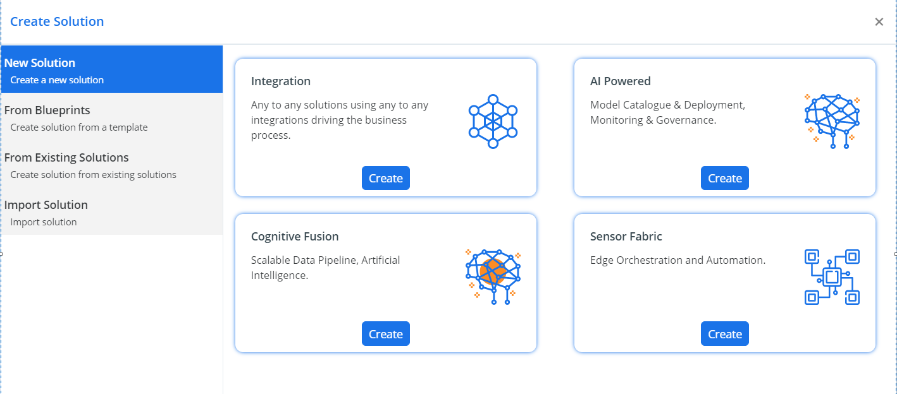

   ### createSolution page
   

- **Web**. To make the code component available from any web browser, select the Web option next to the component. Notice that setting the Web option includes rendering the component in web browsers on PCs, Macs, and mobile devices.

- **Phone**. To make the code component available on phones running Dynamics 365 for phones, select the Phone option next to the component.

 <!-- cards:start -->
         INFO=row@cardTheme-1

        #### IMG= ../_images/logo.png ,
        TXT= first card ,
        SIZE= 3 ^

       #### IMG= ../_images/logo.png ,
        TXT= second card ,
        SIZE= 3 ^ 

       #### IMG= ../_images/logo.png ,
        TXT= third card ,
        SIZE= 3 ^

       #### IMG= ../_images/logo.png ,
        TXT= fourth card ,
        SIZE= 2 ^

       #### IMG= ../_images/logo.png ,
        TXT= fifth card ,
        SIZE= 2 ^

<!-- cards:end -->

 <!-- cards:start -->
         INFO=row@cardTheme-1

        #### IMG= ../_images/logo.png ,
        TXT= sixth card ,
        SIZE= 4 ^

<!-- cards:end -->