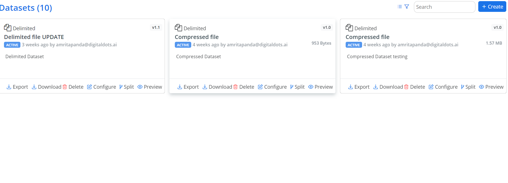
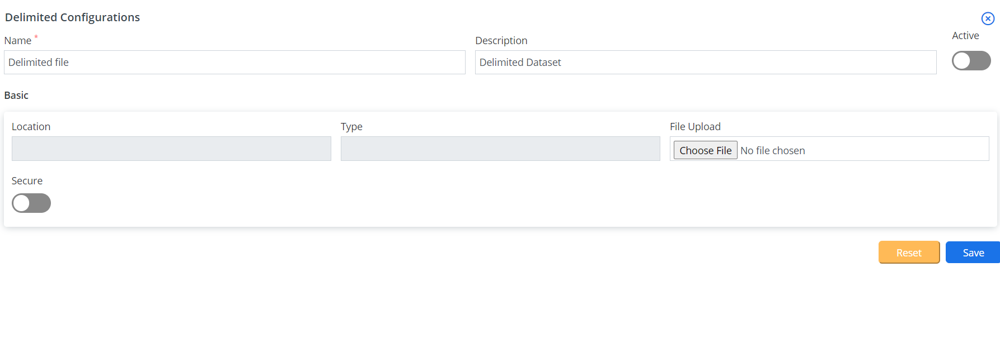
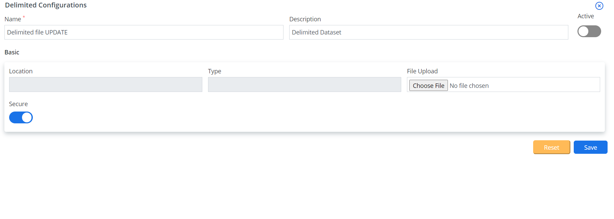
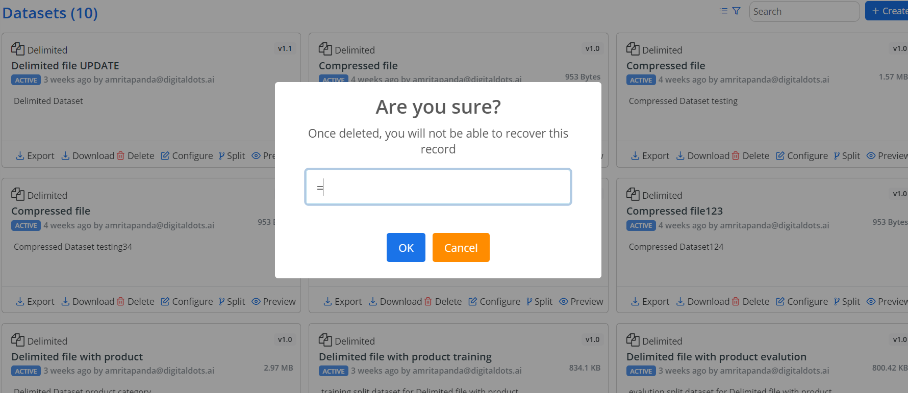

## datasets

this is section1
There are many variations of passages of Lorem Ipsum available, but the majority have suffered alteration in some form, by injected humour, or randomised words which don't look even slightly believable. If you are going to use a passage of Lorem Ipsum, you need to be sure there isn't anything embarrassing hidden in the middle of text. All the Lorem Ipsum generators on the Internet tend to repeat predefined chunks as necessary, making this the first true generator on the Internet. It uses a dictionary of over 200 Latin words, combined with a handful of model sentence structures, to generate Lorem Ipsum which looks reasonable. The generated Lorem Ipsum is therefore always free from repetition, injected humour, or non-characteristic words etc.

### create Dataset

### Edit Dataset

### Delete Dataset

 <!-- cards:start -->
         INFO=row@cardTheme-1

        #### IMG= ../_images/logo.png ,class = justify-contnet-center  w-50,
        TXT= first card , class = text-light ,
        SIZE= 3 ^

       #### IMG= ../_images/logo.png , class= ,
        TXT= second card , class = text-danger ,
        SIZE= 3 ^ 

       #### IMG= ../_images/logo.png , class= ,
        TXT= third card , class = text-uppercase,
        SIZE= 3 ^

       #### IMG= ../_images/logo.png , class = ,
        TXT= fourth card , class = text-info,
        SIZE= 2 ^

       #### IMG= ../_images/logo.png , class= ,
        TXT= fifth card , class= text-capitalize ,
        SIZE= 2 ^

<!-- cards:end -->