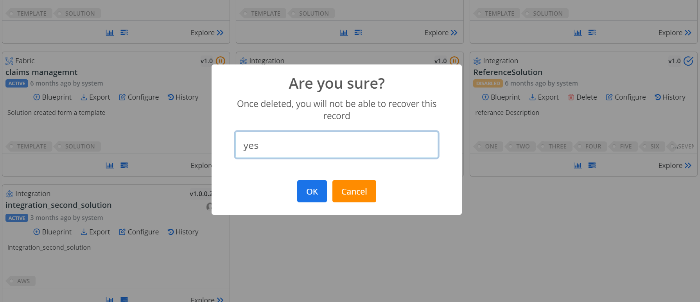

## Delete Solution

### Process to delete 
 Auditing of user access is enabled at the organization level. To enable or disable user access auditing, you must retrieve the target organization’s record, and update the `Organization.IsUserAccessAuditEnabled` attribute value for the organization. Global auditing on the organization must also be enabled by setting the `Organization.IsAuditEnabled` attribute to `true` in the organization record. To audit the origin of user access, for example: web application, Dynamics 365 for Outlook or SDK, you must enable auditing on the entities being accessed.  
  
 The frequency of auditing user access can be read or set using the `Organization.UserAccessAuditingInterval` attribute. The default attribute value of 4 indicates user access is audited once every 4 hours.  
  
 For more information about enabling auditing for an organization and entity, see [Configure Entities and Attributes for Auditing](configure-entities-attributes-auditing.md).  
   
  
-   `AuditAction.UserAccessviaWeb`  
  
-   `AuditAction.UserAccessviaWebServices`  
  
-   `AuditAction.UserAccessAuditStarted`  
  
-   `AuditAction.UserAccessAuditStopped`  
  
 `UserAccessviaWeb` indicates access from the Dataverse web application or Dynamics 365 for Outlook. `UserAccessviaWebServices` indicates a web service request from the SDK. The `AuditAction` enumeration is available to your code when you include `OptionSets.cs` in your application’s project.  
 
 ### Confirmation screen
 
