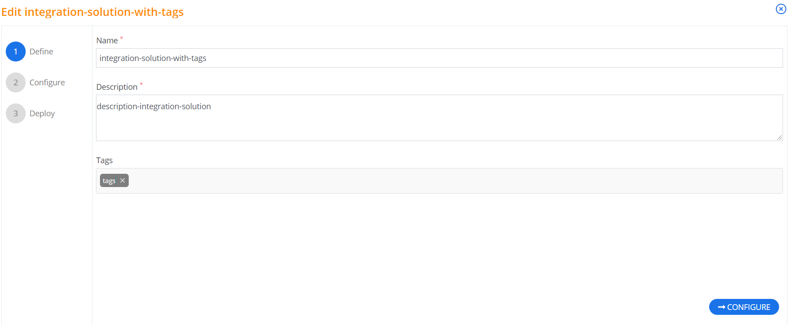
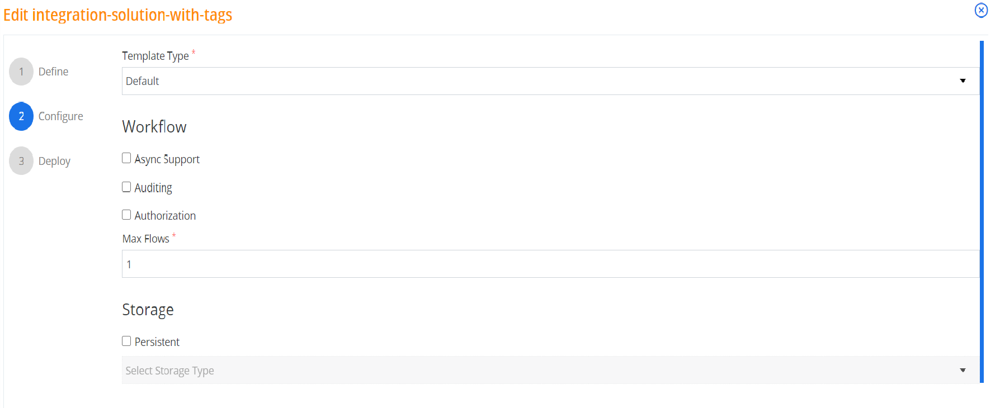
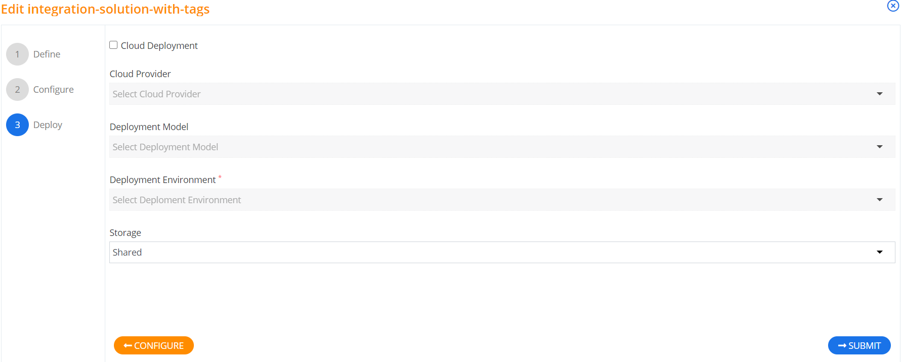

## Editing Solution

### DEFINE

People may have access to multiple Dataverse environments. Unless your application will only connect to a specific environment, you can allow the user to choose which environment they want to connect to by using their credentials to *discover* which environments their credentials authorize them to use. 

To use the discovery service you must authenticate the user for the discovery service and retrieve the environments that are available for them. Usually you must implement some way for them to choose which environment they want to connect to. The next step is to use the information about that environment to authenticate them a second time for access to that specific environment. 

### CONFIGURE

People may have access to multiple Dataverse environments. Unless your application will only connect to a specific environment, you can allow the user to choose which environment they want to connect to by using their credentials to *discover* which environments their credentials authorize them to use. 

To use the discovery service you must authenticate the user for the discovery service and retrieve the environments that are available for them. Usually you must implement some way for them to choose which environment they want to connect to. The next step is to use the information about that environment to authenticate them a second time for access to that specific environment.. 

### DEPLOYE

People may have access to multiple Dataverse environments. Unless your application will only connect to a specific environment, you can allow the user to choose which environment they want to connect to by using their credentials to *discover* which environments their credentials authorize them to use. 

To use the discovery service you must authenticate the user for the discovery service and retrieve the environments that are available for them. Usually you must implement some way for them to choose which environment they want to connect to. The next step is to use the information about that environment to authenticate them a second time for access to that specific environment.. 
]
