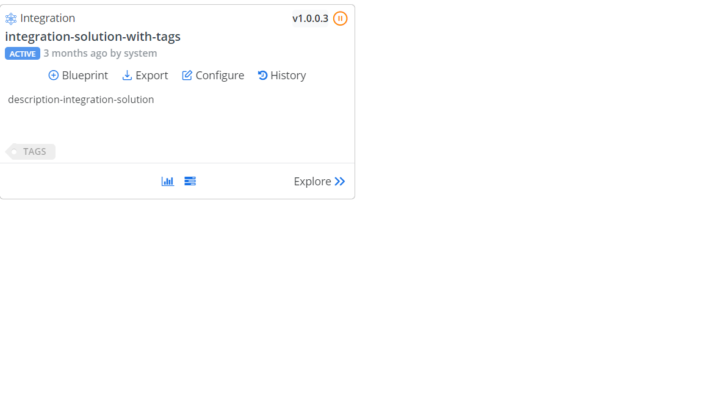

### Solutions

# Card
The following is a selected list of community tools distributed via the XrmToolBox that you can use with Dataverse.

|Tool  |Description  |
|---------|---------|
|[Attribute Manager](https://www.xrmtoolbox.com/plugins/DLaB.Xrm.AttributeManager/)|Used to rename/delete/or change the type of an attribute.|
|[Early Bound Generator](https://www.xrmtoolbox.com/plugins/DLaB.Xrm.EarlyBoundGenerator/)|Generates Early Bound Entities/Option Sets/Actions. Uses CrmSvcUtil from the SDK, and shows command line used to create the classes.|
|[Export to Excel](https://www.xrmtoolbox.com/plugins/Ryr.XrmToolBox.ExportToExcel/)|Easily export records from the selected view/fetchxml to Excel.|
|[FetchXML Builder](https://www.xrmtoolbox.com/plugins/Cinteros.Xrm.FetchXmlBuilder/)|Create and test FetchXml Queries|
|[Metadata Browser](https://www.xrmtoolbox.com/plugins/MsCrmTools.MetadataBrowser/)|Browse metadata from your Dataverse environment|
|[Plugin Trace Viewer](https://www.xrmtoolbox.com/plugins/Cinteros.XrmToolBox.PluginTraceViewer/)|Investigate the Plug-in Trace Log with easy filtering and display possibilities|
|[User Settings Utility](https://www.xrmtoolbox.com/plugins/MsCrmTools.UserSettingsUtility/)|Manage users personal settings in bulk|

Here is another tool, [Chromium Metadata Browser](https://community.dynamicslabs.io/feed/metadata-browser), that lets you browse metadata such as entities, attributes, relationships, option sets of Dataverse environements. It works with Microsoft Edge and Google Chrome browsers. 

 

- [Create Solution](solutions/create-solution.md)
- [Delete Solution](solutions/delete-solution.md)
- [Edit Solution](solutions/edit-solution.md)
- [Export](solutions/export-solution.md)
- [History](solutions/history-solution.md)

